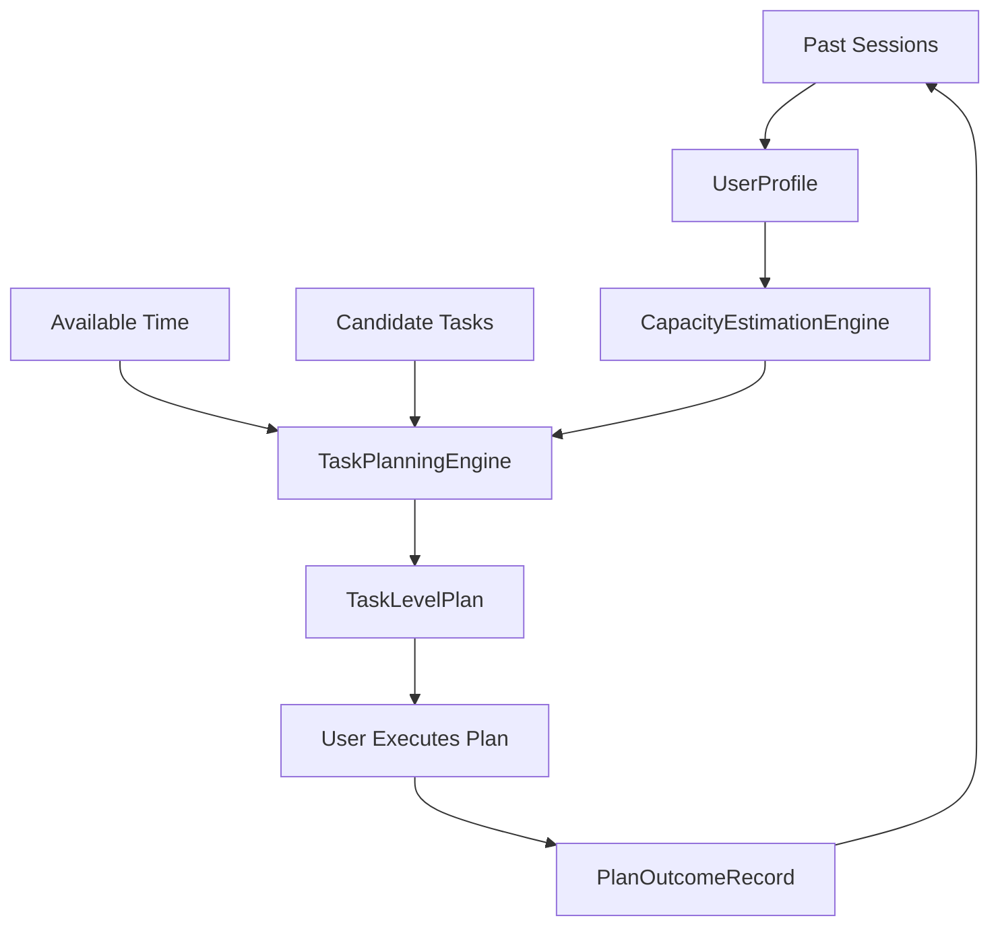

# Personal Planning Agent

A lightweight, rule-based planning prototype that helps users make more realistic study and work plans from their own historical behavior data.

The project focuses on a common planning problem:

```text
Plan: study for 6 hours and finish 5 tasks
Reality: study for 2 hours and finish 1-2 tasks
```

Instead of treating this only as procrastination, the system treats it as a planning calibration problem: users often plan from intention, while their actual capacity is lower or more variable.

This project is intentionally simple and transparent. It uses Python, JSON, and Gradio. It does not use LLMs, LangChain, agent frameworks, databases, or recommendation learning.


## What It Does

Personal Planning Agent helps users complete a practical loop:

```text
Plan -> Execute -> Record Outcome
```

The app supports two workflows:

- Behavioral Workflow: compare planned behavior with actual behavior and save a structured session record.
- Personal Planning Agent: enter available time and candidate tasks, generate a realistic task-level plan, then record what actually happened.

## System Workflow

```text
History
-> UserProfile
-> CapacityEstimationEngine
-> TaskPlanningEngine
-> TaskLevelPlan
-> PlanOutcomeRecord
```



## Key Components

- `SessionRecord`: stores planned behavior, actual behavior, productivity score, and activated patterns.
- `UserProfile`: summarizes historical behavior, completion rate, overplanning frequency, and recent trends.
- `CapacityEstimationEngine`: estimates realistic task capacity from previous actual completion.
- `TaskPlanningEngine`: scores, selects, orders, and allocates time to candidate tasks.
- `TaskLevelPlan`: represents the generated plan, including work time, protected buffer, selected tasks, deferred tasks, risks, and confidence.
- `PlanOutcomeRecord`: records post-session feedback so the system can compare the plan with reality.

## Planning Logic

The planner uses simple rules:

- Protects a buffer before assigning work time.
- Scores tasks by importance and urgency.
- Selects tasks that fit the available work time and estimated capacity.
- Defers lower-priority or over-capacity tasks with rule-based explanations.
- Generates a plan confidence level: `high`, `medium`, or `low`.

This makes the system easy to inspect and suitable as a freshman research prototype.

## Installation

```bash
git clone https://github.com/XueyuLee1/personal-planning-agent.git
cd personal-planning-agent
pip install -r requirements.txt
```

## Usage

Run the Gradio app:

```bash
python app.py
```

Run tests:

```bash
python -m unittest discover -s tests -v
```

## Example

Candidate tasks:

| task_name | estimated_minutes | importance | urgency |
|---|---:|---:|---:|
| STA2001 problem set | 60 | 5 | 5 |
| GRE vocabulary | 40 | 4 | 4 |
| Research reading | 30 | 3 | 2 |

Available time:

```text
120 minutes
```

Possible output:

```text
Personal Planning Report

Available Time: 120 minutes
Work Time: 102 minutes
Protected Buffer: 18 minutes

Selected Tasks:
1. STA2001 problem set - 60 min
2. GRE vocabulary - 40 min

Deferred Tasks:
- Research reading
  Reason: historical capacity suggests limiting task count.

Plan Confidence: low
```

## Project Structure

```text
personal-planning-agent/
├── app.py                  # Gradio app, planning logic, reports, and UI callbacks
├── temporal_memory.py      # JSON history load/save helpers
├── requirements.txt        # Python dependencies
├── style.css               # Gradio styling
├── docs/
│   └── ui-screenshot.png   # README screenshot
└── tests/
    └── test_diagnostics.py # Unit tests
```

## Limitations

This is a rule-based MVP, not a full AI agent.

It does not include:

- LLM reasoning
- reinforcement learning
- automatic activity tracking
- calendar integration
- database storage
- recommendation learning

The system depends on user-entered tasks, time estimates, and outcome feedback.

## Roadmap

Useful next steps should improve planning quality without making the system unnecessarily complex:

- Save generated `TaskLevelPlan` objects more explicitly in history.
- Analyze plan-vs-outcome trends across many sessions.
- Improve capacity estimation after enough outcome records exist.
- Add task difficulty or task type as optional fields.
- Add simple visual summaries for overplanning and completion rate.

## Status

MVP complete.

The project now demonstrates a full local loop:

```text
Plan -> Execute -> Record Outcome
```

It is best understood as a transparent personal planning calibration prototype.
