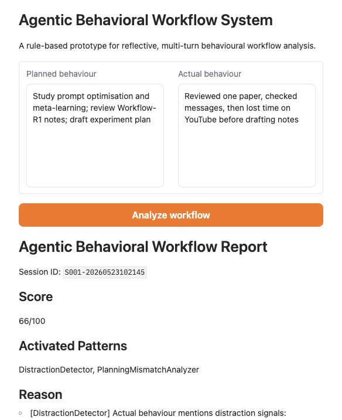
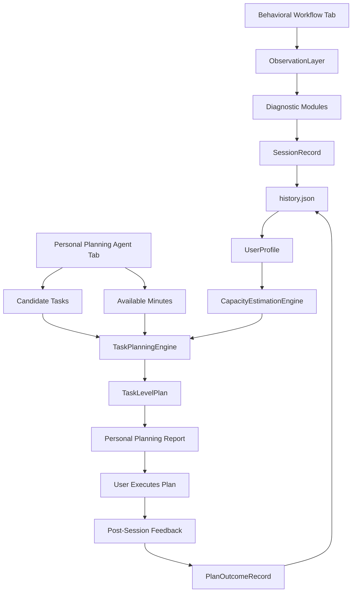
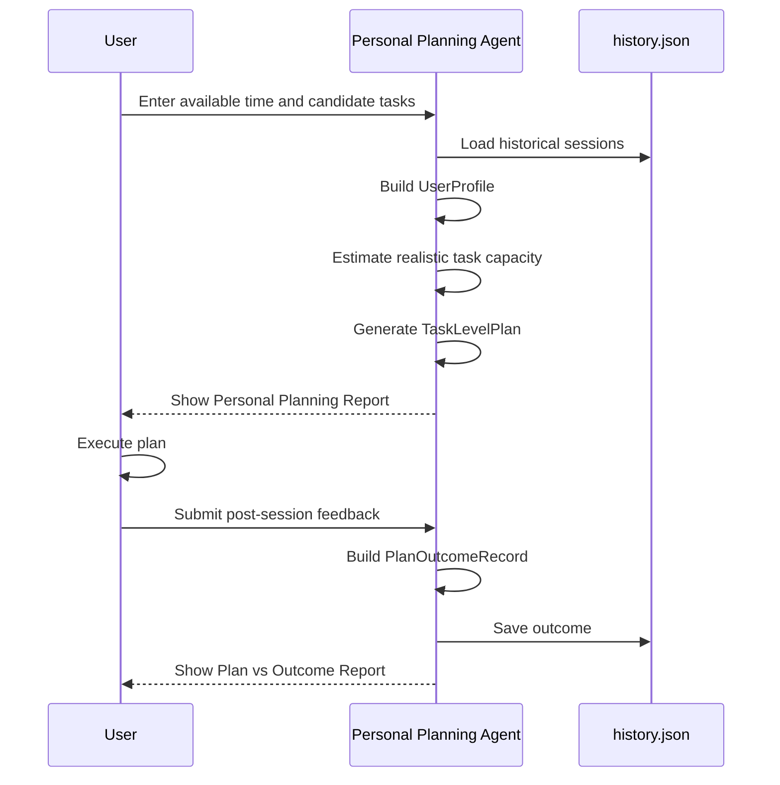
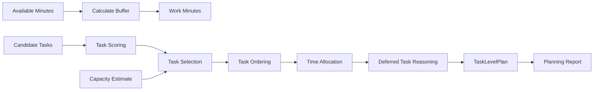
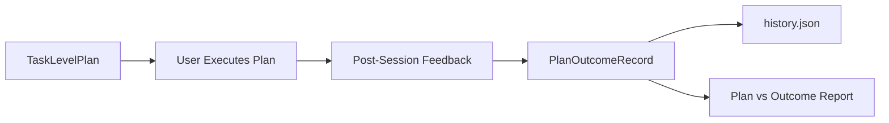

# Personal Planning Agent

Personal Planning Agent is a rule-based planning prototype that helps users make more realistic study and work plans from their own historical behavior data.

It is built around a simple idea: people often plan according to intention, not capacity. The system records what users planned, what they actually completed, estimates their realistic task capacity, generates task-level plans, and lets users record the outcome after execution.

This project is intentionally transparent and lightweight. It uses Python, JSON, and Gradio. It does not use LLMs, LangChain, agent frameworks, databases, or recommendation learning.



> The screenshot shows the Gradio interface. Update it before major UI changes so the README stays aligned with the current app.

## Problem

Many people repeatedly create plans that are too ambitious:

```text
Plan: study for 6 hours and finish 5 tasks
Reality: study for 2 hours and finish 1-2 tasks
```

This is often not simply procrastination. It is a planning calibration problem.

The project focuses on two related concepts:

- Planning fallacy: people underestimate how long tasks take and overestimate how much they can complete.
- Overplanning: people schedule more work than their historical behavior suggests they can realistically finish.

Personal Planning Agent helps users move from vague intention to concrete, capacity-aware planning:

```text
What can I realistically do next, given what usually happens when I plan?
```

## Core Workflow

The current MVP implements the full loop:

```text
Plan -> Execute -> Record Outcome
```

At the system level:

```text
History
-> UserProfile
-> CapacityEstimation
-> TaskPlanningEngine
-> TaskLevelPlan
-> PlanOutcomeRecord
```

## Architecture



## Planning Loop



## Main Components

### SessionRecord

`SessionRecord` stores a behavioral session from the Behavioral Workflow tab.

It records:

- planned text
- actual text
- planned tasks
- actual tasks
- planned task count
- actual task count
- score
- activated patterns

This gives the system historical evidence about how much the user tends to plan versus complete.

### UserProfile

`UserProfile` summarizes historical behavior.

It includes:

- total sessions
- average score
- average planned tasks
- average actual tasks
- average completion rate
- overplanning frequency
- common activated patterns
- recent score trend

This is not a machine-learned psychological model. It is a transparent summary of historical planning behavior.

### CapacityEstimationEngine

`CapacityEstimationEngine` estimates realistic task capacity from past actual task completion.

It outputs:

- estimated task capacity
- reliable task range
- confidence level
- evidence basis
- risk notes

This prevents the planner from simply filling all available time with tasks.

### TaskPlanningEngine

`TaskPlanningEngine` generates concrete task-level plans.

It performs:

- task scoring
- task selection
- buffer allocation
- task ordering
- time allocation
- deferred task reasoning
- planning risk generation
- plan confidence estimation

Task priority is calculated with a simple rule:

```text
priority_score = importance * 0.6 + urgency * 0.4
```

The engine also considers whether a task fits the available work time.

### TaskLevelPlan

`TaskLevelPlan` is the generated plan.

It contains:

- available minutes
- work minutes
- protected buffer minutes
- selected tasks
- deferred tasks
- planning risks
- plan confidence

Example:

```text
Available time: 120 minutes
Work time: 102 minutes
Protected buffer: 18 minutes

Selected:
1. STA2001 problem set - 60 min
2. GRE vocabulary - 40 min

Deferred:
- Research reading
  Reason: historical capacity suggests limiting task count.
```

### PlanOutcomeRecord

`PlanOutcomeRecord` closes the loop after execution.

It records:

- plan ID
- planned tasks
- planned minutes
- completed tasks
- actual minutes
- interruption count
- task switch count
- fatigue level
- completion rate
- notes

This lets the system preserve what happened after the generated plan was executed.

## Gradio Interface

The app has two tabs.

### Behavioral Workflow

Use this tab after a study or work session when you want to compare planned behavior and actual behavior.

Inputs:

- planned behavior
- actual behavior

Output:

- behavioral workflow report
- score
- activated patterns
- reflection
- capacity estimate
- planning recommendation

This tab also creates `SessionRecord` entries in local history.

### Personal Planning Agent

Use this tab before and after a planning session.

Before execution, enter:

- available minutes
- candidate tasks
- estimated minutes
- importance from 1 to 5
- urgency from 1 to 5

Then click:

```text
Generate Plan
```

The system displays:

- Available Time
- Work Time
- Protected Buffer
- Selected Tasks
- Deferred Tasks
- Task Order
- Plan Confidence
- Planning Risks

After execution, submit:

- actually completed tasks
- actual study minutes
- interruption count
- task switch count
- fatigue level
- notes

Then click:

```text
Record Outcome
```

The system displays a Plan vs Outcome Report and saves a `PlanOutcomeRecord`.

## Task-Level Planning Flow



## Outcome Recording Flow



## Installation

Clone the repository:

```bash
git clone <your-repo-url>
cd behavioral-workflow-agent
```

Install dependencies:

```bash
pip install -r requirements.txt
```

If installing manually:

```bash
pip install gradio
```

## Usage

Run the app:

```bash
python app.py
```

Open the local Gradio URL shown in the terminal.

Run tests:

```bash
python -m unittest discover -s tests -v
```

## Project Structure

```text
Personal Planning Agent/
├── app.py                  # Gradio app, planning engines, reports, and UI callbacks
├── temporal_memory.py      # JSON history load/save helpers
├── requirements.txt        # Python dependencies
├── style.css               # Gradio styling
├── docs/
│   └── ui-screenshot.png   # UI screenshot used in README
└── tests/
    └── test_diagnostics.py # Unit tests for memory, planning, UI callbacks, and reports
```

## Usage Example

### Generate A Plan

Input:

| task_name | estimated_minutes | importance | urgency |
|---|---:|---:|---:|
| STA2001 problem set | 60 | 5 | 5 |
| GRE vocabulary | 40 | 4 | 4 |
| Research reading | 30 | 3 | 2 |

Available time:

```text
120 minutes
```

Possible output:

```text
Personal Planning Report

Available Time
120 minutes

Work Time
102 minutes

Protected Buffer
18 minutes

Selected Tasks
1. STA2001 problem set - 60 min
2. GRE vocabulary - 40 min

Deferred Tasks
- Research reading
  Type: capacity_limit
  Reason: Deferred because historical capacity suggests limiting task count.

Plan Confidence
low
```

### Record Outcome

After executing the plan, enter:

```text
Completed tasks: STA2001 problem set
Actual minutes: 70
Interruptions: 1
Task switches: 2
Fatigue: 3 / 5
```

Possible output:

```text
Plan vs Outcome Report

Planned Tasks
- STA2001 problem set
- GRE vocabulary

Completed Tasks
- STA2001 problem set

Planned Minutes
100 minutes

Actual Minutes
70 minutes

Completion Rate
50%
```

## Memory

The app stores local history in:

```text
history.json
```

This file may contain personal behavior data and should not be committed to GitHub.

To reset memory:

1. Stop the app.
2. Delete `history.json`.
3. Restart the app.

## Tests

The test suite covers:

- diagnostic modules
- persistent JSON history compatibility
- `SessionRecord`
- `UserProfile`
- `CapacityEstimationEngine`
- task scoring
- task selection
- buffer allocation
- time allocation
- deferred task reasoning
- `TaskLevelPlan`
- Gradio planning callback
- `PlanOutcomeRecord`
- Plan vs Outcome report generation
- backward compatibility

Run:

```bash
python -m unittest discover -s tests -v
```

## Limitations

This is a rule-based MVP.

It does not implement:

- LLM reasoning
- DeepSeek or other model integration
- LangChain
- agent frameworks
- recommendation learning
- database storage
- automatic activity tracking
- calendar integration

The system depends on user-entered task estimates and feedback.

## Future Roadmap

Future work should focus on improving practical planning value without overcomplicating the system:

- Save generated `TaskLevelPlan` objects more explicitly in history.
- Analyze `PlanOutcomeRecord` trends across many sessions.
- Compare planned minutes vs actual minutes over time.
- Improve capacity estimation using accumulated outcome records.
- Add recommendation learning only after enough plan-outcome data exists.
- Add optional task difficulty and task type fields.
- Add visual summaries for overplanning, completion rate, and capacity calibration.

## Project Status

MVP complete.

The project now supports:

```text
Plan -> Execute -> Record Outcome
```

It is a practical, transparent prototype for personal planning calibration and task-level plan generation.
