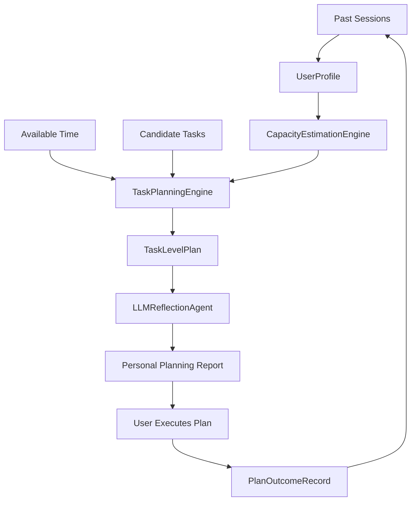

# Personal Planning Agent

A lightweight, rule-based planning prototype that helps users make more realistic study and work plans from their own historical behavior data.

The project focuses on a common planning problem:

```text
Plan: study for 6 hours and finish 5 tasks
Reality: study for 2 hours and finish 1-2 tasks
```

Instead of treating this only as procrastination, the system treats it as a planning calibration problem: users often plan from intention, while their actual capacity is lower or more variable.

This project is intentionally simple and transparent. It uses Python, JSON, Gradio, and an optional LLM reflection layer. It does not use LangChain, agent frameworks, databases, or recommendation learning.

The design is LLM-assisted, not LLM-dependent: the rule-based planner still makes the task selection and time allocation decisions, while the optional LLM reflection agent explains the plan, highlights risks, suggests the next action, and asks one follow-up question.


## What It Does

Personal Planning Agent helps users complete a practical loop:

```text
Plan -> Execute -> Record Outcome
```

The app supports two workflows:

- Behavioral Workflow: compare planned behavior with actual behavior and save a structured session record.
- Personal Planning Agent: enter available time and candidate tasks, generate a realistic task-level plan, then record what actually happened.

## System Workflow

```text
History
-> UserProfile
-> CapacityEstimationEngine
-> TaskPlanningEngine
-> TaskLevelPlan
-> LLMReflectionAgent
-> PlanOutcomeRecord
```



## Key Components

- `SessionRecord`: stores planned behavior, actual behavior, productivity score, and activated patterns.
- `UserProfile`: summarizes historical behavior, completion rate, overplanning frequency, and recent trends.
- `CapacityEstimationEngine`: estimates realistic task capacity from previous actual completion.
- `TaskPlanningEngine`: scores, selects, orders, and allocates time to candidate tasks.
- `TaskLevelPlan`: represents the generated plan, including work time, protected buffer, selected tasks, deferred tasks, risks, and confidence.
- `LLMReflectionAgent`: optionally explains the rule-based plan using an external LLM provider, with rule-based fallback when no API key is configured.
- `PlanOutcomeRecord`: records post-session feedback so the system can compare the plan with reality.
- `OutcomeTrend`: summarizes recent completion rate, planned-vs-actual minutes, interruptions, task switching, and fatigue.

Generated `TaskLevelPlan` records and post-session `PlanOutcomeRecord` entries are both saved into local JSON history. This lets the system summarize recent planning trends instead of only producing one-shot plans.

## Planning Logic

The planner uses simple rules:

- Protects a buffer before assigning work time.
- Scores tasks by importance and urgency.
- Selects tasks that fit the available work time and estimated capacity.
- Defers lower-priority or over-capacity tasks with rule-based explanations.
- Generates a plan confidence level: `high`, `medium`, or `low`.
- Summarizes recent generated plans, outcomes, completion rate, interruptions, task switching, and fatigue.
- Reduces the next work budget conservatively when recent outcomes show low completion, high fatigue, frequent interruptions, or heavy task switching.

This makes the system easy to inspect and suitable as a freshman research prototype.

## Agent Interpretation

This project should not be described as a full autonomous LLM agent. A more accurate description is:

```text
LLM-assisted personal planning workflow with rule-based planning, memory, reflection, and feedback.
```

The current modules correspond to an agent-style loop:

- Observation: user-entered planned behavior, actual behavior, available time, and candidate tasks.
- Memory: local JSON history of sessions, generated plans, and outcomes.
- Reflection: rule-based summaries plus optional LLM-generated explanation, risk reflection, next action, and one follow-up question.
- Planning: task selection, ordering, time allocation, and buffer protection.
- Evaluation: post-session outcome records and plan-vs-outcome summaries.

The LLM is deliberately placed after `TaskLevelPlan`. It does not replace the transparent planning rules or directly change the selected tasks.

## Optional LLM Reflection

The app can call an external LLM provider for reflective planning advice. This is optional: the planning engine works without any API key.

DeepSeek is the default supported provider because its Chat Completions API is OpenAI-compatible and uses `https://api.deepseek.com` as the base URL.

Set an API key before running the app:

```bash
cp .env.example .env
export DEEPSEEK_API_KEY="your-api-key"
export DEEPSEEK_MODEL="deepseek-v4-flash"  # optional
python app.py
```

The app reads environment variables from your shell. If you use `.env`, load it with your preferred shell command or copy the values into your terminal session before running the app.

If no API key is available, the app still works and uses a rule-based fallback reflection. This keeps the project demoable without external services.

The LLM reflection agent outputs:

- reflection
- risk explanation
- next action
- one follow-up question

OpenAI can still be used as an optional provider by setting:

```bash
export LLM_PROVIDER="openai"
export OPENAI_API_KEY="your-api-key"
export OPENAI_MODEL="gpt-4o-mini"
python app.py
```

## History Dashboard

The Personal Planning Agent tab includes a history summary view. It reports:

- generated plan count
- recorded outcome count
- recent completion rate
- planned vs actual minutes
- interruptions
- task switches
- fatigue
- adaptive planning adjustment

If there are fewer than three outcome records, the system clearly marks the trend as preliminary instead of pretending to have strong personalization evidence.

## Installation

```bash
git clone https://github.com/XueyuLee1/personal-planning-agent.git
cd personal-planning-agent
pip install -r requirements.txt
```

## Usage

Run the Gradio app:

```bash
python app.py
```

Run tests:

```bash
python -m unittest discover -s tests -v
```

## Example

Candidate tasks:

| task_name | estimated_minutes | importance | urgency |
|---|---:|---:|---:|
| STA2001 problem set | 60 | 5 | 5 |
| GRE vocabulary | 40 | 4 | 4 |
| Research reading | 30 | 3 | 2 |

Available time:

```text
120 minutes
```

Possible output:

```text
Personal Planning Report

Available Time: 120 minutes
Work Time: 102 minutes
Protected Buffer: 18 minutes

Selected Tasks:
1. STA2001 problem set - 60 min
2. GRE vocabulary - 40 min

Deferred Tasks:
- Research reading
  Reason: historical capacity suggests limiting task count.

Plan Confidence: low
```

## Project Structure

```text
personal-planning-agent/
├── .env.example            # Optional LLM provider configuration template
├── app.py                  # Gradio app, planning logic, reports, and UI callbacks
├── llm_reflection.py       # Optional LLM reflection agent and provider adapters
├── planning_models.py      # Shared data models for sessions, plans, and outcomes
├── temporal_memory.py      # JSON history load/save helpers
├── requirements.txt        # Python dependencies
├── style.css               # Gradio styling
├── docs/
│   └── ui-screenshot.png   # README interface preview
└── tests/
    └── test_diagnostics.py # Unit tests
```

## Limitations

This is an LLM-assisted MVP, not a full autonomous AI agent.

It does not include:

- LLM control over task selection or time allocation
- reinforcement learning
- automatic activity tracking
- calendar integration
- database storage
- recommendation learning

The system depends on user-entered tasks, time estimates, and outcome feedback.

## Roadmap

Useful next steps should improve planning quality without making the system unnecessarily complex:

- Analyze plan-vs-outcome trends across many sessions.
- Improve capacity estimation after enough outcome records exist.
- Add task difficulty or task type as optional fields.
- Add simple visual summaries for overplanning and completion rate.
- Evaluate whether LLM reflections improve user understanding or planning follow-through.

## Status

MVP complete.

The project now demonstrates a full local loop:

```text
Plan -> Execute -> Record Outcome
```

It is best understood as a transparent personal planning calibration prototype.
